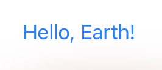
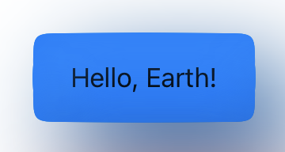

# Chris's SwiftUI Claymorphic Kit

Contains a view modifer, shape & button style to draw Claymorphism Style UI's in SwiftUI

```
import SwiftUI
import ClaymorphicKit

struct MyView: View {
  
  var body: some View {
    Button {
      print("pressed")
    } label: {
      Text("Hello, Earth!")
    }
    .frame(width: 140, height: 56)
    .buttonStyle(ClaymorphicButtonStyle(color: .blue,
                                        radius: 20,
                                        inflation: 0.5,
                                        animation: Animation.wiggleJiggle))
  }
  
}
```

| Before | After |
|--------|-------|
|

